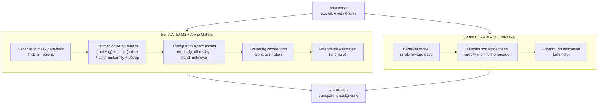

# Production-Grade Extraction -- Two Approaches

## Context

- Each input image contains ONE category of items (all cutlery, all glasses, all plates, etc.)
- We extract ALL instances of that item in their exact positions
- No GroundingDINO, no text prompts -- we do not need to specify what to extract
- Both scripts output RGBA PNGs with production-quality alpha edges

## Two Scripts, Same Interface




## Script A: `02a_extract_sam2_matting.py`

Same SAM2 auto approach we already have, but **upgraded with alpha matting** for production edges.

**Pipeline:**

1. SAM2 automatic mask generation (finds all regions)
2. Three-stage filtering (area size, color uniformity, IoU dedup) -- same as current v2
3. **NEW: Trimap generation** from each kept binary mask
  - Erode mask by N pixels -> definite foreground
  - Dilate mask by N pixels -> definite background
  - Band between them -> unknown region
4. **NEW: PyMatting** closed-form alpha estimation on each trimap
5. **NEW: Foreground color estimation** (`estimate_foreground_ml`) to eliminate halos
6. Combine into final RGBA

**Key code for the matting upgrade:**

```python
from pymatting import estimate_alpha_cf, estimate_foreground_ml

def binary_mask_to_alpha(image_f64, mask_bool, erode_px=3, dilate_px=5):
    """Convert SAM2 binary mask to production alpha matte."""
    mask_u8 = mask_bool.astype(np.uint8)
    k_e = np.ones((erode_px, erode_px), np.uint8)
    k_d = np.ones((dilate_px, dilate_px), np.uint8)
    fg = cv2.erode(mask_u8, k_e, iterations=1)
    outer = cv2.dilate(mask_u8, k_d, iterations=1)
    trimap = np.full(mask_u8.shape, 0.5, dtype=np.float64)
    trimap[fg == 1] = 1.0
    trimap[outer == 0] = 0.0
    alpha = estimate_alpha_cf(image_f64, trimap)
    return np.clip(alpha, 0, 1)
```

## Script B: `02b_extract_birefnet.py`

Completely different approach -- a dedicated background removal model that outputs a soft alpha matte in a single forward pass. No SAM2, no filtering heuristics.

**Pipeline:**

1. Load RMBG-2.0 (built on BiRefNet architecture) from HuggingFace
2. Single forward pass -> grayscale alpha matte (continuous 0.0 - 1.0)
3. Foreground color estimation (`estimate_foreground_ml`) to eliminate halos
4. Compose RGBA

**Key code:**

```python
from transformers import AutoModelForImageSegmentation
import torch
from torchvision import transforms

model = AutoModelForImageSegmentation.from_pretrained(
    "briaai/RMBG-2.0", trust_remote_code=True
)
model.to("cuda").eval()

transform = transforms.Compose([
    transforms.Resize((1024, 1024)),
    transforms.ToTensor(),
    transforms.Normalize([0.485, 0.456, 0.406], [0.229, 0.224, 0.225]),
])

input_tensor = transform(image_pil).unsqueeze(0).to("cuda")
with torch.no_grad():
    pred = model(input_tensor)[-1].sigmoid().cpu()
alpha = pred[0].squeeze().numpy()
# Resize alpha back to original image dimensions
alpha = np.array(Image.fromarray((alpha * 255).astype(np.uint8)).resize(image_pil.size))
```

**Pros:** Simpler, no heuristics, trained specifically for foreground/background separation, handles soft edges natively.
**Cons:** No control over what counts as "foreground" -- it decides. May keep table decorations/shadows we want removed. Cannot target specific object types.

## Shared Components

Both scripts share:

- Same CLI: `--batch --input-dir ./cutlery --output-dir ./outputs/cutlery_A --debug`
- Same debug outputs: `*_1_masks.png`, `*_2_alpha.png`, `*_3_overlay.png`, `*_4_rgba_full.png`
- Same `crop_content()`, `estimate_foreground_ml()` post-processing
- Same batch processing and JSON report generation

## Dependencies

```
pymatting>=1.1.0         # Alpha matting (Script A)
# RMBG-2.0 loads via transformers (already installed), needs:
pip install transformers>=4.44.0 torch torchvision
# SAM2 already installed
```

## How to Compare

Run both on the same inputs, then visually compare:

```bash
# Script A: SAM2 + matting
python 02a_extract_sam2_matting.py --batch --input-dir ./cutlery --output-dir ./outputs/cutlery_A --debug

# Script B: BiRefNet
python 02b_extract_birefnet.py --batch --input-dir ./cutlery --output-dir ./outputs/cutlery_B --debug

# Compare outputs side by side
```

Look for:

- Edge quality (zoom to 400% on item boundaries)
- Table surface removal (any table fragments remaining?)
- Color accuracy (any halos or color shifts?)
- Small item detection (did it catch every fork/glass?)

